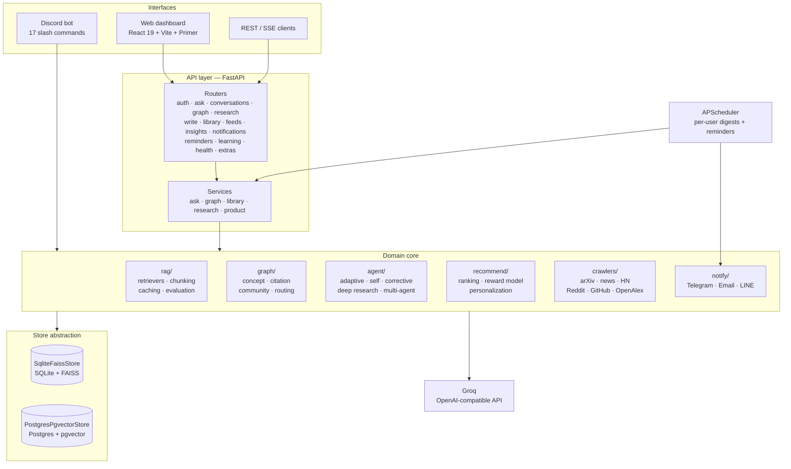
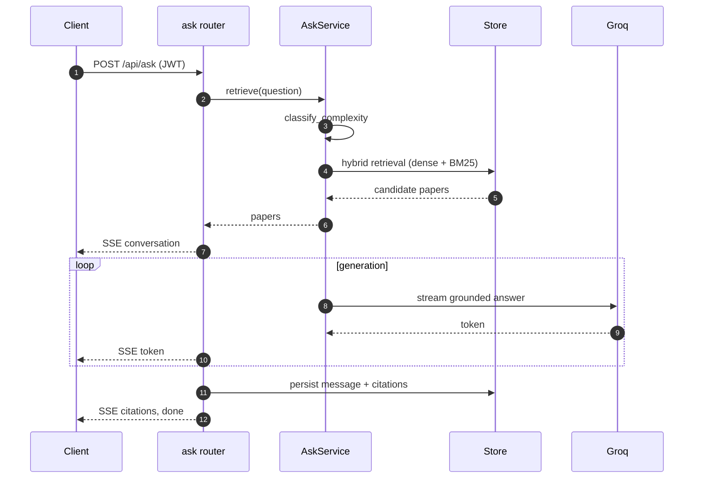
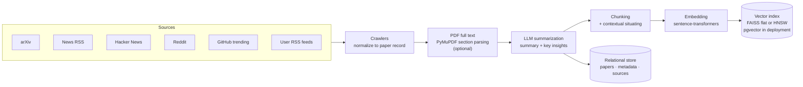
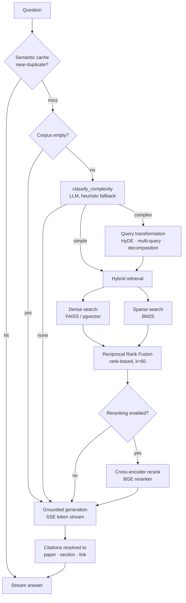
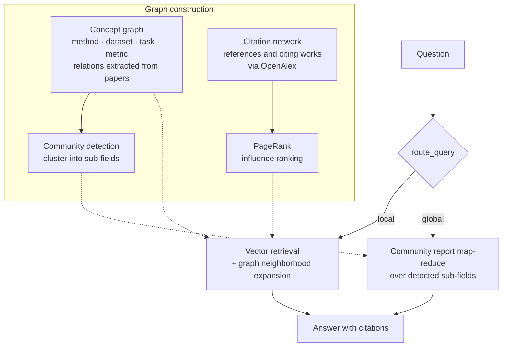
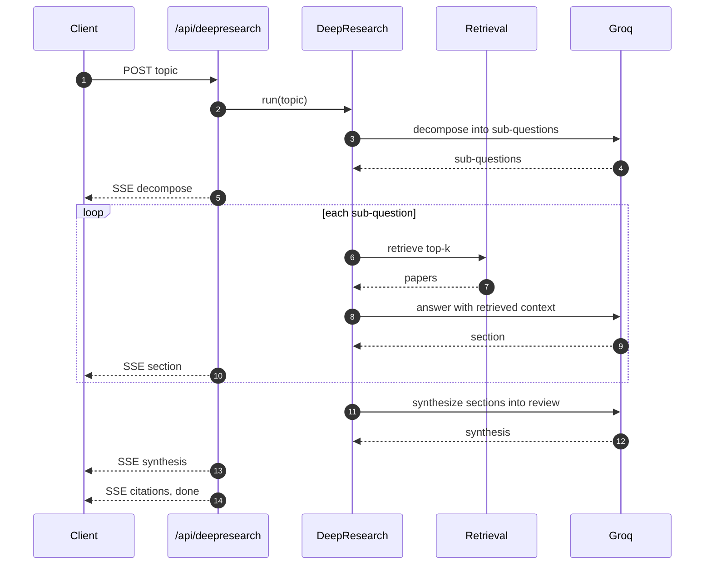
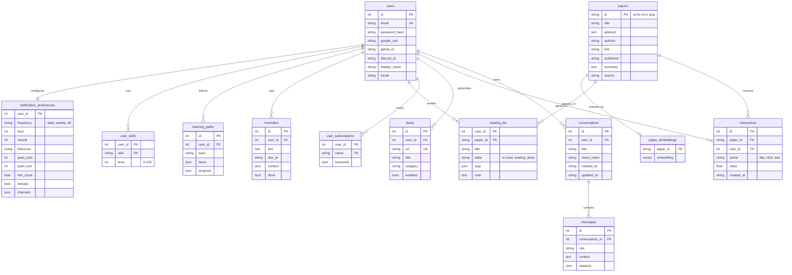
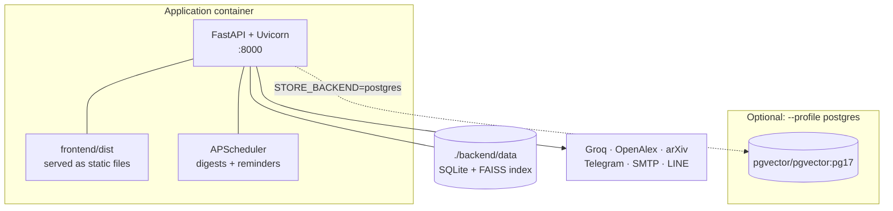

<div align="center">

# ScholaRAGent

"Scholar + RAG + Agent"

A Full-Stack Open-Source Academic Research Assistant Platform Powered by Agentic AI and Deeply-Engineered Multi-Paradigm RAG.

[](https://github.com/ShiYu0318/ScholaRAGent/actions/workflows/ci.yml)
[](#testing)
[](https://www.python.org/)
[](https://react.dev/)
[](https://fastapi.tiangolo.com/)
[](LICENSE)

[Quick start](#quick-start) · [Architecture](#architecture) · [How retrieval works](#how-retrieval-works) · [API](#api-reference) · [Contributing](#contributing)

</div>

---

## Table of contents

- [Overview](#overview)
- [Quick start](#quick-start)
- [Architecture](#architecture)
- [How retrieval works](#how-retrieval-works)
- [Knowledge graph](#knowledge-graph)
- [Agentic workflows](#agentic-workflows)
- [Evaluation](#evaluation)
- [Features](#features)
- [Web dashboard](#web-dashboard)
- [Discord bot](#discord-bot)
- [API reference](#api-reference)
- [Data model](#data-model)
- [Configuration](#configuration)
- [Deployment](#deployment)
- [Project structure](#project-structure)
- [Testing](#testing)
- [Troubleshooting](#troubleshooting)
- [Contributing](#contributing)
- [License](#license)

## Overview

### The problem

Staying current in a fast-moving research field is a daily tax. Relevant work is scattered
across arXiv, conference proceedings, community discussion, and code repositories. Reading
everything is impossible; reading nothing means missing the paper that mattered. And once
you have read something, the knowledge is stranded — in a PDF folder, a bookmark bar, or a
note-taking app that cannot answer questions.

### What ScholaRAGent does

ScholaRAGent continuously collects research artifacts from multiple sources, summarizes each
one, and indexes it into a knowledge base you can query in natural language. Answers stream
back with citations that resolve to a specific paper, section, and link — so every claim is
checkable.

Retrieval spans two complementary representations of the same corpus:

- a **vector and lexical index** for finding specific passages, and
- a **knowledge graph** of concepts and citations for reasoning about a field as a whole.

On top of that sit agentic workflows — multi-step research decomposition, self-reflective
retrieval, and a multi-agent write-and-critique loop — plus a product layer that handles
accounts, personalized ranking, scheduled digests, and analytics.

### Design principles

| Principle | How it shows up |
| --- | --- |
| **Runs on free, local components** | Local sentence-transformers embeddings, local FAISS index, SQLite. The only required credential is a Groq API key (free tier is sufficient). |
| **Degrade, never crash** | Every optional capability — reranking, OAuth, PDF ingestion, OpenAlex citations, Telegram/Email/LINE delivery — is detected at startup and skipped when unconfigured. |
| **One persistence boundary** | A single `Store` interface covers relational data and vector search, so the same code runs on SQLite+FAISS locally and Postgres+pgvector in deployment. |
| **Testable without the internet** | Every external dependency sits behind an injectable interface. The full suite runs offline with no model downloads and no credentials. |
| **LLM-optional control flow** | Routing and classification prefer an LLM but fall back to deterministic heuristics, so the system stays functional and testable without one. |

## Quick start

### Prerequisites

| Requirement | Needed for |
| --- | --- |
| [Groq API key](https://console.groq.com) | Generation, summarization, LLM routing (free tier works) |
| Docker, or Python 3.13 + [`uv`](https://github.com/astral-sh/uv) | Running the stack |
| Node.js 22+ | Frontend development only |
| [Discord bot token](https://discord.com/developers/applications) | The Discord interface only |

### Option 1 — Docker Compose

The image bakes the frontend build into the API container, so one service serves both.

```bash
git clone https://github.com/ShiYu0318/ScholaRAGent.git
cd ScholaRAGent

cp backend/.env.example backend/.env
# Set GROQ_API_KEY at minimum

docker compose up --build                      # SQLite + FAISS, data in ./backend/data
docker compose --profile postgres up --build   # Postgres + pgvector instead
```

Web UI and API: `http://localhost:8000` · Interactive API docs: `http://localhost:8000/docs`

For the Postgres profile, also set `STORE_BACKEND=postgres` and `DATABASE_URL` in
`backend/.env`.

### Option 2 — Local development

```bash
# Backend — all uv commands run from backend/
cd backend
uv sync                     # first run pulls PyTorch and is slow
cp .env.example .env        # then fill in your keys
uv run python main.py api   # API at :8000, serves frontend/dist when present
uv run python main.py bot   # Discord bot instead
uv run python main.py all   # both

# Frontend — separate terminal, hot reload, proxies /api to :8000
cd frontend
npm install
npm run dev                 # http://localhost:5173
```

### First steps

1. Open the dashboard and create an account (or use Google/GitHub if OAuth is configured).
2. **Library -> Fetch today** pulls and indexes the latest arXiv batch.
3. Ask a question from **Ask** — the answer streams in with cited sources.
4. From there: expand a citation graph in **Graph**, add RSS sources in **Library -> Feeds**,
   set a digest schedule in **Settings**, and watch **Trends** populate as the corpus grows.

## Architecture

Three interfaces share one core. The API layer is thin — routers handle HTTP concerns and
delegate to services, which compose the domain modules under `src/`.



### Layer responsibilities

- **Routers** own HTTP: validation, auth dependencies, status codes, and SSE framing. They
  contain no domain logic.
- **Services** compose domain modules into use cases and hold the only mutable process
  state. Each exposes a `set_*_service()` injection point, which is how endpoint tests run
  fully offline.
- **Domain modules** are independent and side-effect-light. They accept their collaborators
  as constructor arguments rather than importing singletons.
- **The store** is the single persistence boundary. Everything above it — users, papers,
  conversations, reading state, preferences, and vectors — goes through one interface, so
  swapping SQLite+FAISS for Postgres+pgvector changes no calling code.

### Request lifecycle

A streaming question, end to end:



## How retrieval works

### Ingestion

Collection normalizes heterogeneous sources into one paper record, then writes to both
representations — relational rows for structured queries, vectors for semantic search.



Chunks are **contextually situated** before embedding: each chunk is prefixed with a short
description of where it sits in its parent document. This preserves meaning that a bare
chunk loses — a passage saying "this improves accuracy by 4 points" is far more retrievable
when the embedding also knows which method and benchmark it belongs to.

### Query pipeline

Retrieval depth is chosen per question rather than fixed. Cheap questions skip retrieval
entirely; multi-faceted ones get query expansion and reranking.



**Why Reciprocal Rank Fusion.** Dense and lexical retrievers produce scores on
incomparable scales — cosine similarity against BM25 term weights. Normalizing them into a
common range requires calibration that shifts with corpus and query. RRF sidesteps this
entirely by discarding scores and fusing on rank alone: each result contributes
`1 / (k + rank)` to its document (rank counted from 1), summed across retrievers.

The constant `k = 60` deliberately flattens the curve. A document ranked tenth by *both*
retrievers scores `2/70 = 0.029`, which beats a document ranked first by only *one* of them
at `1/61 = 0.016`. Cross-retriever agreement is worth more than a top position in a single
ranking — exactly the behavior you want when fusing two methods that fail in different ways:
vector search misses exact identifiers, BM25 misses paraphrase, and a document both agree on
is unlikely to be an artifact of either failure mode. The system fetches 20 candidates per
retriever before fusion, then truncates to the requested result count.

**Two orthogonal routers.** `classify_complexity` decides retrieval *depth*
(none / simple / complex); `route_query` decides retrieval *scope* (local neighborhood
versus global community reports). Both prefer an LLM classification and fall back to
keyword heuristics, which keeps the pipeline working — and deterministically testable —
without a model.

### Retrieval strategies

| Strategy | Module | What it addresses |
| --- | --- | --- |
| Hybrid dense + sparse | `rag/retrievers/hybrid.py` | Vector search misses exact identifiers; BM25 misses paraphrase |
| Query transformation | `rag/query_transform.py` | Vocabulary mismatch between question and document phrasing |
| Multi-query expansion | `rag/retrievers/multi_query.py` | Single phrasings under-retrieve on multi-faceted questions |
| Cross-encoder reranking | `rag/retrievers/reranker.py` | Bi-encoder recall is cheap but imprecise at the top |
| Parent-document retrieval | `rag/retrievers/parent.py` | Small chunks retrieve well but answer poorly without context |
| Contextual chunk embedding | `rag/contextual.py` | Isolated chunks lose their document-level meaning |
| Semantic caching | `rag/semantic_cache.py` | Repeated and near-duplicate questions waste tokens |
| Chunk-level citations | `rag/chunk_citations.py` | Document-level citations do not show *where* a claim came from |

## Knowledge graph

Beyond passage retrieval, the corpus is projected into two graphs that support questions
passage search cannot answer — "what are the sub-fields here", "what did this paper build
on", "which work is most influential".



- **Concept graph** — relations between methods, datasets, tasks, and metrics are extracted
  from paper text into a directed graph (NetworkX).
- **Citation network** — a seed paper expands into prior work (references) and derivative
  work (citing papers) through OpenAlex, resolved by arXiv DOI with a title-search fallback.
- **Community detection** produces sub-field clusters; each cluster gets an LLM-written
  report. Global search answers corpus-level questions by map-reducing over those reports
  rather than over raw chunks.
- **PageRank** over the citation network surfaces structurally influential papers, which is
  a different signal from raw citation count.

The dashboard renders both graphs as an interactive D3 force layout with click-to-reseed;
a table view is the fallback when a graph is too sparse to lay out usefully.

## Agentic workflows

### Deep research

Decomposes a topic, researches each sub-question independently, then synthesizes a cited
review. Every stage streams to the client, so a multi-minute run shows progress instead of
a spinner.



### Agent patterns

| Pattern | Module | Behavior |
| --- | --- | --- |
| Adaptive RAG | `agent/adaptive_rag.py` | Classify complexity, then skip / single-shot / multi-step retrieve |
| Self-RAG | `agent/self_rag.py` | Reflect on evidence sufficiency and refine before answering |
| Corrective RAG | `agent/corrective_rag.py` | Fall back to external search when local retrieval confidence is low |
| Iterative retrieval | `agent/research_agent.py` | Multi-round retrieve-and-decide loops for multi-hop questions |
| Multi-agent | `agent/multi_agent.py` | Planner, Retriever, Writer, Critic with a bounded revision loop |
| Tool calling | `agent/tool_agent.py` | Natural-language agent over local tools: search, trends, tasks, calendar export |

## Evaluation

Two tracks, because they answer different questions.

**Deterministic offline metrics** — precision@k, recall, MRR, lexical faithfulness, and
citation accuracy. No LLM involved, so they are fast, free, and safe to assert on in CI as
regression gates.

**LLM-as-judge metrics** — RAGAS-style claim-level faithfulness, answer relevancy, and
context precision/recall, implemented directly against the Groq client. Adding the `ragas`
package would have pulled in 41 transitive dependencies including the entire LangChain
ecosystem, with two version conflicts against the existing stack; the metrics themselves are
a few hundred lines, so they are implemented natively instead.

`compare_pipelines` scores multiple RAG configurations against a shared golden dataset,
which is how retrieval changes get evaluated before they are merged rather than after.

```bash
POST /api/eval  {"engine": "offline"}   # deterministic, always available
POST /api/eval  {"engine": "judge"}     # LLM-judged, 503 without GROQ_API_KEY
```

## Features

### Collection and summarization
- **Multi-source ingestion** — arXiv, AI news RSS, Hacker News, Reddit, GitHub trending, and
  X/Twitter, plus per-user custom RSS feeds.
- **LLM summarization** — a concise summary and key insights for every item.
- **PDF full-text ingestion** — parse arXiv PDFs into titled sections (abstract, method,
  results) so answers draw on full text rather than abstracts alone.

### Retrieval and question answering
- Hybrid dense + sparse retrieval fused by RRF, with optional HNSW indexing at scale.
- Query transformation (HyDE, multi-query, decomposition) and cross-encoder reranking.
- Parent-document retrieval, contextual chunk embedding, and a semantic answer cache.
- Traceable chunk-level citations resolving to paper, section, and link.

### Knowledge graph
- Concept graph over methods, datasets, tasks, and metrics.
- Citation network expansion with PageRank influence ranking.
- Community detection with per-community summaries.
- Local/global query routing and community-report global search.

### Research workflow
- Literature review generation with identified research gaps.
- Multi-paper method comparison tables.
- Guided deep-read explanations of dense papers.
- Credibility signals from citation data and reproducibility signals from linked code.
- Reading kanban (to-read / reading / done) with drag-and-drop, plus topic subscriptions.
- Exports: BibTeX with generated keys, CSV, and Obsidian-ready Markdown with frontmatter and
  wikilinks (compatible with Juggl and Dataview).
- Writing assistance: LaTeX drafts, slide outlines, polishing, contribution extraction,
  review suggestions, and submission checklists.

### Accounts, delivery, and personalization
- **Auth** — email + password (bcrypt, JWT), Google and GitHub OAuth, Discord account linking.
- **Notification preferences** — frequency, delivery time, timezone, quiet hours, channels,
  and deduplication, all per user.
- **Per-user scheduling** — APScheduler cron-schedules each user's digest from their
  preferences and polls due reminders every minute.
- **Weekly digest** with rising-keyword detection and next-period forecasting.
- **Learning paths and skills** — generated study plans per topic with progress tracking.
- **Analytics** — activity timelines, action totals, reading pipeline, and top topics.
- **Preference reward model** — a Bradley-Terry model learns ranking weights from clicks,
  likes, subscriptions, ratings, and questions.
- **Trend forecasting** — keyword time series with an LSTM sliding-window forecaster.
- **Health monitoring** — store statistics, scheduler state, and provider-key readiness.

## Web dashboard

| Page | Purpose |
| --- | --- |
| **Overview** | Card wall: today's papers, weekly digest, trends, to-read, recent conversations, reading analytics, system health |
| **Ask** | Token-streamed Q&A over the corpus with adaptive retrieval and cited sources |
| **Conversations** | Persistent history with search, rename, delete, and public share links |
| **Research** | Deep research (live streamed), literature review, comparison, report, BibTeX, guided explain |
| **Write** | Polish, contribution extraction, review suggestions, checklist, LaTeX draft, slide outline |
| **Graph** | Interactive D3 citation and concept graphs with PageRank and communities; global search; table fallback |
| **Library** | Paper list with credibility and reproducibility signals, fetch-today, personalized picks, reading kanban, RSS manager, exports |
| **Trends** | Rising keywords by slope, per-keyword series with forecast, data-source status |
| **Learning** | Topic-based learning path generation with progress; skill levels |
| **Analytics** | Activity chart, action totals, reading pipeline, top topics |
| **Settings** | Account, locale, theme, OAuth and Discord links, notification schedule, reminders, system status |

**Interface design.** Built on [Primer React](https://primer.style/) in night mode: `#0d1117`
canvas, `#30363d` hairlines, `#2f81f7` accent, 6px radii, GitHub-like information density.
A day theme is one toggle away. Fully bilingual (EN/ZH) via react-i18next, with locale
persisted to the user profile. `⌘K` opens a command palette. Streaming endpoints are consumed
as `fetch` streams so requests can carry POST bodies and an Authorization header, which
`EventSource` cannot do.

## Discord bot

A secondary interface sharing the same core, for teams that live in chat.

| Command | Description |
| --- | --- |
| `/daily` | Fetch, summarize, and push today's papers now |
| `/ask <question>` | Answer from the knowledge base with cited papers |
| `/deepresearch <topic>` | Decompose a topic and synthesize a cited review |
| `/report <topic>` | Structured report over relevant papers |
| `/litreview <topic>` | Literature review with research gaps |
| `/compare <topic>` | Multi-paper method comparison table |
| `/bibtex <topic>` | Collect relevant papers and export BibTeX |
| `/explain <topic>` | Guided deep-read of the most relevant paper |
| `/trends` | Rising keywords across the corpus |
| `/sources` | Trending content from HN, GitHub, Reddit, and news |
| `/latex <topic>` | LaTeX paper draft skeleton |
| `/slides <topic>` | Slide outline |
| `/review <text>` | Paper-review suggestions |
| `/like <id>` | Record a preference to improve recommendations |
| `/agent <request>` | Natural-language agent that calls tools |
| `/set_push_time <h> <m>` | Set the daily push time (persisted) |
| `/help` | Command help and current push time |

Setup: create an application in the [Discord Developer Portal](https://discord.com/developers/applications),
copy the bot token into `DISCORD_BOT_TOKEN`, then under **OAuth2 -> URL Generator** select
scopes `bot` and `applications.commands` with `Send Messages`, `Read Message History`, and
`Embed Links`. Setting `DISCORD_GUILD_ID` syncs slash commands to one guild instantly;
leaving it unset uses global sync, which can take up to an hour to propagate.

## API reference

Every endpoint is browsable live at `/docs` (Swagger UI) and `/redoc`. Unless marked
**public**, endpoints require `Authorization: Bearer <JWT>` from register/login or OAuth.
Streaming endpoints emit Server-Sent Events as `data: {json}\n\n` frames.

### Auth — `/auth`

| Method | Path | Description |
| --- | --- | --- |
| POST | `/auth/register` | Create an account, returns `{token, user}` — public |
| POST | `/auth/login` | Sign in, returns `{token, user}` — public |
| GET | `/auth/me` | Current user profile |
| PATCH | `/auth/me` | Update `display_name`, `locale`, or password |
| GET | `/auth/providers` | Which OAuth providers are configured — public |
| GET | `/auth/oauth/{provider}` | Begin Google/GitHub sign-in (302) — public |
| GET | `/auth/oauth/{provider}/callback` | OAuth callback, redirects with token — public |
| POST | `/auth/discord/link` | Get the Discord account-linking URL |
| DELETE | `/auth/discord/link` | Unlink Discord |

### Q&A and conversations — `/api`

| Method | Path | Description |
| --- | --- | --- |
| POST | `/api/ask` | **SSE** — streamed grounded answer; events: `conversation`, `token`, `citations`, `done` |
| GET | `/api/conversations` | List conversations (`?query=` searches titles and messages) |
| GET | `/api/conversations/{id}` | One conversation with messages and citations |
| PATCH | `/api/conversations/{id}` | Rename |
| DELETE | `/api/conversations/{id}` | Delete (204) |
| POST | `/api/conversations/{id}/share` | Create a public share link, returns `{token, url}` |
| GET | `/api/shared/{token}` | Read a shared conversation — public |

### Library and papers — `/api`

| Method | Path | Description |
| --- | --- | --- |
| GET | `/api/papers` | List papers (`?limit=&source=&query=`) with reproducibility signals |
| GET | `/api/paper/{id}` | Paper detail with credibility and reproducibility signals |
| POST | `/api/daily` | Fetch today's arXiv batch, store and index it |
| GET | `/api/daily/personalized` | Papers ranked against your interaction profile |
| POST | `/api/interactions` | Log an interaction for recommendations (201) |
| GET | `/api/reading` | Reading kanban items (`?state=to-read\|reading\|done`) |
| POST | `/api/reading` | Add to the kanban (201) |
| PATCH | `/api/reading/{paper_id}` | Move between states |
| DELETE | `/api/reading/{paper_id}` | Remove (204) |
| GET | `/api/export/csv` | Export the library as CSV |
| GET | `/api/export/bibtex` | Export as BibTeX |
| GET | `/api/export/obsidian` | Export as an Obsidian-ready Markdown archive |

### Feeds and subscriptions — `/api`

| Method | Path | Description |
| --- | --- | --- |
| GET | `/api/feeds` | Your RSS feeds |
| POST | `/api/feeds` | Add a feed (201; 409 on duplicate) |
| PATCH | `/api/feeds/{id}` | Update title, category, or enabled state |
| DELETE | `/api/feeds/{id}` | Remove (204) |
| POST | `/api/feeds/refresh` | Fetch all enabled feeds into the library |
| GET | `/api/subscriptions` | Your keyword subscriptions |
| POST | `/api/subscriptions` | Add a subscription (201) |
| DELETE | `/api/subscriptions/{name}` | Remove one (204) |

### Graph — `/api/graph`

| Method | Path | Description |
| --- | --- | --- |
| GET | `/api/graph/citation?seed=` | Citation network around a seed, with nodes, edges, PageRank, and communities |
| GET | `/api/graph/concept` | Concept graph over the corpus (`?refresh=1` rebuilds) |
| GET | `/api/graph/global?query=` | Community-report map-reduce answer for corpus-level questions |

### Research and writing — `/api`

| Method | Path | Description |
| --- | --- | --- |
| POST | `/api/deepresearch` | **SSE** — events: `decompose`, `section`, `synthesis`, `citations`, `done` |
| POST | `/api/litreview` | Literature review over retrieved papers |
| POST | `/api/compare` | Multi-paper method comparison table |
| POST | `/api/report` | Structured topic report with citations |
| POST | `/api/bibtex` | BibTeX for retrieved papers |
| POST | `/api/explain` | Guided plain-language deep-read of one paper |
| POST | `/api/write/{tool}` | `polish`, `contributions`, `review`, `checklist`, `latex`, `slides` |

### Insights — `/api`

| Method | Path | Description |
| --- | --- | --- |
| GET | `/api/trends` | Rising keywords by slope plus top keywords (`?granularity=month\|year&top=`) |
| GET | `/api/trends/{keyword}` | One keyword's time series and next-period forecast |
| GET | `/api/digest/weekly` | Weekly digest: top recent papers, keywords, LLM overview |
| GET | `/api/analytics` | Activity, action totals, reading pipeline, top topics (`?days=`) |

### Notifications, reminders, learning — `/api`

| Method | Path | Description |
| --- | --- | --- |
| GET | `/api/notifications/preferences` | Your notification preferences |
| PUT | `/api/notifications/preferences` | Update them; the scheduler reschedules immediately |
| GET | `/api/reminders` | Open reminders (`?include_done=true` for all) |
| POST | `/api/reminders` | Create (201) |
| POST | `/api/reminders/{id}/complete` | Mark done |
| DELETE | `/api/reminders/{id}` | Delete (204) |
| GET | `/api/learning-paths` | Your learning paths |
| POST | `/api/learning-paths` | Generate a path for a topic (201) |
| PATCH | `/api/learning-paths/{id}` | Update items, progress, or topic |
| DELETE | `/api/learning-paths/{id}` | Delete (204) |
| GET | `/api/skills` | Your skill levels |
| PUT | `/api/skills` | Set a skill level (0-100) |

### System — `/api`

| Method | Path | Description |
| --- | --- | --- |
| GET | `/api/health` | Store stats, scheduler status, provider readiness (booleans only) — public |
| GET | `/api/sources` | Data-source configuration status |
| GET | `/api/memory` | Agent memory items (`?kind=&contains=&limit=`) |
| POST | `/api/memory` | Add a memory item (201) |
| POST | `/api/eval` | RAG evaluation — `engine=offline` or `engine=judge` |
| POST | `/api/agent` | Tool-calling agent (503 without `GROQ_API_KEY`) |

## Data model

One schema across both store backends. Vectors live in a FAISS index file locally and in a
`paper_embeddings` table under Postgres; everything else is identical.



## Configuration

Settings live in `backend/.env`, which is never committed. The minimum working setup:

```bash
GROQ_API_KEY=your-groq-api-key       # required

JWT_SECRET=$(openssl rand -hex 32)   # recommended: ephemeral if unset
SCHEDULER_ENABLED=1                  # per-user digests and reminders
STORE_BACKEND=sqlite                 # or postgres, with DATABASE_URL
```

Everything else is optional and safely skipped when unset.

| Variable | Required | Description |
| --- | :---: | --- |
| `GROQ_API_KEY` | yes | Groq API key |
| `GROQ_MODEL` | | Model id (default `llama-3.3-70b-versatile`) |
| `GROQ_BASE_URL` | | OpenAI-compatible endpoint override |
| `DISCORD_BOT_TOKEN` | bot | Discord bot token |
| `DISCORD_CHANNEL_ID` | bot | Channel for the daily push |
| `DISCORD_GUILD_ID` | | Guild id for instant slash-command sync |
| `ARXIV_QUERY` | | arXiv query (default `cat:cs.AI`) |
| `DAILY_COUNT` / `REPORT_COUNT` | | Papers per daily push / per report |
| `PUSH_HOUR` / `PUSH_MINUTE` / `PUSH_TZ_OFFSET` | | Default push time and timezone offset |
| `EMBED_MODEL` | | Embedding model (default `all-MiniLM-L6-v2`, or `BAAI/bge-m3`) |
| `INDEX_TYPE` / `HNSW_M` | | Vector index: `flat` (exact) or `hnsw` (approximate) |
| `RERANK_ENABLED` / `RERANK_MODEL` | | Cross-encoder reranking |
| `TELEGRAM_BOT_TOKEN` / `TELEGRAM_CHAT_ID` | | Telegram delivery |
| `SMTP_HOST` / `SMTP_PORT` / `SMTP_USER` / `SMTP_PASSWORD` / `SMTP_FROM` / `EMAIL_TO` | | Email delivery |
| `LINE_CHANNEL_TOKEN` / `LINE_TO` | | LINE delivery (Messaging API) |
| `GITHUB_TOKEN` | | Raises GitHub API rate limits |
| `X_BEARER_TOKEN` | | X/Twitter crawler (X API v2 requires a paid plan) |
| `JWT_SECRET` | | Auth secret; ephemeral if unset, so set it in production |
| `JWT_EXPIRE_MINUTES` | | Token lifetime (default 7 days) |
| `CORS_ORIGINS` / `API_PUBLIC_URL` / `FRONTEND_URL` | | Deployment URLs |
| `GOOGLE` / `GITHUB` / `DISCORD_CLIENT_ID` and `_SECRET` | | OAuth sign-in and Discord linking |
| `STORE_BACKEND` / `DATABASE_URL` | | `sqlite` (default) or `postgres` |
| `SCHEDULER_ENABLED` | | Per-user digest and reminder scheduler |

**Notes.** The arXiv, news, Hacker News, Reddit, and GitHub crawlers need no credentials.
Telegram, Email, LINE, OAuth, and X/Twitter activate only once their keys are present.
Changing `EMBED_MODEL` changes vector dimensionality; the store detects the mismatch and
rebuilds the index automatically. Leaving `JWT_SECRET` unset generates a random secret at
startup, which invalidates every existing token on restart — acceptable locally, not in
production.

## Deployment

The Docker build is multi-stage: the frontend compiles in a Node stage and its `dist` output
is copied into the Python image, which FastAPI serves as static files behind the API routes.
One container, one port.



**Scaling notes.** The default `IndexFlatIP` is exact and fine well past tens of thousands
of papers; switch `INDEX_TYPE=hnsw` when approximate search becomes worth the recall
tradeoff. The scheduler holds in-process state (dedupe sets, fired-reminder ids), so running
multiple API replicas with `SCHEDULER_ENABLED=1` would duplicate digests — run the scheduler
in exactly one replica. Postgres + pgvector is the path to horizontal scaling, since
SQLite+FAISS assumes a single writer and a local index file.

## Project structure

Backend and frontend are fully separated; the root holds only cross-cutting orchestration.

```
backend/                 Python backend — run all uv commands from here
  main.py                Entry point: api | bot | all
  pyproject.toml         Dependencies (uv)
  .env                   Secrets and settings, not version-controlled
  src/
    config.py            Settings loaded from backend/.env
    config_report.py     Startup readiness and degraded-feature report
    api/                 app, deps, auth, routers/ (14), services/ (5)
    store/               base (interface), sqlite_faiss, postgres_pgvector
    scheduler.py         Per-user digest and reminder scheduling
    crawlers/            arxiv, news, hackernews, reddit, github, twitter, openalex
    llm/                 groq_client, key_rotator
    rag/                 embedder, chunker, retrievers/, contextual, caching,
                         citations, pdf_ingest, pipeline, evaluation, llm_judge
    graph/               concept_graph, citation_network, graph_rag, global_search,
                         router, relationship, visualize
    agent/               adaptive_rag, self_rag, corrective_rag, research_agent,
                         deep_research, multi_agent, tool_agent
    analysis/            trends, lstm_forecaster
    recommend/           ranker, reward, personalize, reading_list, credibility,
                         reproducibility, subscriptions
    tools/               registry, builtins, research_tools, writing_tools,
                         task_manager, calendar_ics, obsidian_export
    memory/  notify/  db/  utils/  bot/
  tests/                 73 offline test modules + tests/e2e (Playwright)
  data/                  Generated index, metadata, SQLite database
frontend/                React 19 + Vite + TypeScript + Primer
  src/pages/             14 route components
  src/components/        Shell, Card, ForceGraph, BarChart, CommandPalette, Markdown
  src/lib/               api, auth, sse clients
  src/i18n/              EN/ZH translations
Dockerfile               Multi-stage: frontend dist baked into the API image
docker-compose.yml       Single container; optional Postgres via --profile postgres
.github/workflows/       CI: backend (with pgvector), frontend, Docker build
```

## Testing

The suite is offline and deterministic by construction: a fake embedder with stable hashing,
stubbed LLM and network clients, and injected transports. No model downloads, no credentials,
no network. That is what makes it usable as a pre-commit gate rather than a nightly job.

```bash
cd backend
uv run pytest                     # 390 passed, 20 skipped (postgres and e2e skip locally)
E2E=1 uv run pytest tests/e2e     # Playwright UI smoke, needs both dev servers running
```

Store behavior tests are parameterized over both backends and run against real
Postgres+pgvector whenever `TEST_DATABASE_URL` is set. CI sets it via a service container, so
the same assertions verify both persistence implementations:

```
CI backend job:  403 passed, 7 skipped     # includes the pgvector-backed store tests
Local:           390 passed, 20 skipped    # those tests skip without a database
```

CI additionally type-checks and builds the frontend, and validates the Docker image build on
`main`.

## Troubleshooting

| Symptom | Cause and fix |
| --- | --- |
| `503` from `/api/agent` or `/api/eval?engine=judge` | No `GROQ_API_KEY`. These endpoints require generation and refuse rather than returning degraded output. |
| Every token invalid after a restart | `JWT_SECRET` is unset, so a random one is generated per start. Set it. |
| Retrieval returns nothing | The corpus is empty. Run **Library -> Fetch today** or `POST /api/daily`. |
| Vector dimension mismatch errors | `EMBED_MODEL` changed. The store detects this and rebuilds; delete `backend/data/faiss.index` if it persists. |
| Digests never arrive | `SCHEDULER_ENABLED` is off, the channel has no credentials, or delivery falls inside quiet hours. Check `GET /api/health`. |
| Slash commands missing in Discord | Global sync takes up to an hour. Set `DISCORD_GUILD_ID` for instant per-guild sync. |
| `uv sync` is very slow on first run | It resolves and downloads PyTorch. Subsequent runs are cached. |
| Frontend loads but API calls fail in dev | The Vite dev server proxies `/api` to `:8000` — make sure the backend is running there. |

## Contributing

```bash
# 1. Branch
git checkout -b feature/your-feature

# 2. Verify before pushing
cd backend  && uv run pytest -q
cd frontend && npx tsc --noEmit && npm run build
```

Conventions that keep the suite fast and the review short:

- **Tests are offline.** Stub external calls and inject transports; see `backend/tests/` for
  the established patterns. A test that needs network or credentials will not run in CI.
- **New services get an injection point.** Follow the `set_*_service()` convention so
  endpoint tests can substitute a double.
- **One commit per feature**, with a conventional subject: `feat(scope): add thing`.
- **Optional dependencies degrade.** If a feature needs a key or a model, detect its absence
  and skip cleanly rather than raising.

Open a pull request once CI is green (backend with pgvector, frontend build, Docker build).

## License

MIT — see [LICENSE](LICENSE).
